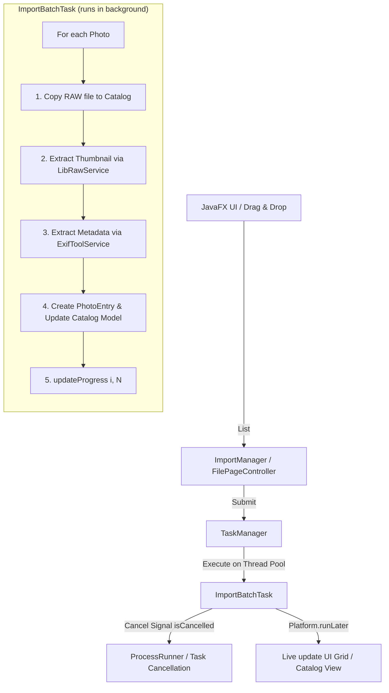

# Implementation Plan: Import Pipeline, Task System & ExifTool Integration

This plan addresses the questions regarding ExifTool JSON mapping, CommandBuilder lifecycle, and the end-to-end architecture of the asynchronous Photo Import Pipeline and Task Manager.

---

## 1. Core Architectural Answers to User Inquiries

### 1.1 ExifTool Output & Gson Mapping
* **Case Sensitivity & Naming**: ExifTool outputs keys with PascalCase (`Make`, `Model`, `FNumber`, `DateTimeOriginal`). In Java, we use camelCase (`make`, `model`, `aperture`). Gson will **not** automatically match them unless:
  1. We use `@SerializedName("Make")` on the DTO fields.
  2. Or we parse the output as a `JsonObject` and extract fields manually.
* **ExifTool Output is an Array**: ExifTool `-json` always returns a **JSON Array** `[{ ... }]`, not a single object! Calling `new Gson().fromJson(json, PhotoMetadata.class)` will throw `JsonSyntaxException` unless deserialized as a list/array.
* **Iterating Color Styles**: In ExifTool, passing multiple candidate tags (`-PictureStyle`, `-PictureControlName`, `-FilmMode`, etc.) produces keys only for the tags that exist. We can inspect the parsed JSON map and take the first non-null value.

### 1.2 CommandBuilder Lifecycle: Static vs. Singleton vs. Instance
* **A CommandBuilder must be instantiated per use (`new ExifToolCommandBuilder()`)**.
* It stores mutable state (`args`, `files`). If it were static or a singleton, concurrent threads or successive calls would accumulate previous arguments, causing duplicate flags, wrong file paths, and memory leaks.

### 1.3 Concurrency & Process Blocking
* `ProcessRunner.run()` is **blocking** by design (it waits for the native process to complete).
* Therefore, **`ExifToolService` and `LibRawService` must never be called on the JavaFX Application Thread**.
* They must be invoked inside background tasks managed by `TaskManager`.

---

## 2. Import Pipeline & Task Concurrency Architecture

### 2.1 The UI Task Problem: Micro-tasks vs. Batch Job
If an import of 200 photos spawns individual tasks for copy, metadata, and thumbnail extraction, the UI would be spammed with 600 task entries.

#### Proposed Design: The **Batch Job Model**
* When the user imports $N$ photos, a single **`ImportBatchTask`** is created for that batch.
* The task progresses through the photos, reporting aggregate progress (`current / total`) and status messages to the UI.
* If the user imports a **second batch** while the first is still running:
  * A second `ImportBatchTask` is submitted to `TaskManager`.
  * They run concurrently up to the thread pool limit (or queue if max workers reached).
  * The UI Task Drawer simply shows 2 active batch cards (e.g. *"Importing 42 photos..."* and *"Importing 15 photos..."*), each with its own cancel button.



---

## 3. Proposed Component Changes

### Component 1: `domain.catalog.PhotoMetadata` & ExifTool DTO
#### [MODIFY] `PhotoMetadata.java`
Add `@SerializedName` annotations or a factory method `fromRawMap(...)` to cleanly decouple ExifTool's raw tag names from our domain model.

#### [NEW] `ExifToolRawDto.java` in `infra.services.exiftool`
An internal data transfer object matching ExifTool's exact JSON keys:
```java
public class ExifToolRawDto {
    @SerializedName("Make") public String make;
    @SerializedName("Model") public String model;
    @SerializedName("LensModel") public String lensModel;
    @SerializedName("FNumber") public Double fNumber;
    @SerializedName("ExposureTime") public String exposureTime;
    @SerializedName("ISO") public Integer iso;
    @SerializedName("DateTimeOriginal") public String dateTimeOriginal;
    @SerializedName("Rating") public Integer rating;
    
    // Maker-specific color profile tags
    @SerializedName("PictureStyle") public String pictureStyle;           // Canon
    @SerializedName("PictureControlName") public String pictureControl;   // Nikon
    @SerializedName("FilmMode") public String filmMode;                   // Fuji
    @SerializedName("CreativeStyle") public String creativeStyle;         // Sony
    @SerializedName("PhotoStyle") public String photoStyle;               // Panasonic
    @SerializedName("PictureMode") public String pictureMode;             // Olympus
    
    public String resolveColorStyle() {
        if (pictureStyle != null) return pictureStyle;
        if (pictureControl != null) return pictureControl;
        if (filmMode != null) return filmMode;
        if (creativeStyle != null) return creativeStyle;
        if (photoStyle != null) return photoStyle;
        if (pictureMode != null) return pictureMode;
        return "Standard";
    }
}
```

---

### Component 2: Fix Bugs in `ExifToolCommandBuilder` & `ExifTag`
#### [MODIFY] `ExifTag.java`
1. Split the combined `COLOR_MODE` tag into individual tags or remove leading hyphens so each argument is passed properly to `ProcessBuilder`.
2. Ensure tag names do not contain embedded spaces when passed as single arguments.

#### [MODIFY] `ExifToolCommandBuilder.java`
1. Fix `addTag`: Prepend `"-"` to each tag name so ExifTool recognizes it as a tag query instead of a file name.
2. Return a new instance from a factory method or ensure callers do `new ExifToolCommandBuilder()`.

#### [MODIFY] `ExifToolService.java`
1. Remove the instance-level `ExifToolCommandBuilder builder` field (instantiate freshly in methods).
2. Parse JSON as an array: `ExifToolRawDto[] results = gson.fromJson(stdout, ExifToolRawDto[].class);`.
3. Map `ExifToolRawDto` to `PhotoMetadata`.
4. Support bulk extraction: `readMetadata(List<Path> paths, BooleanSupplier isCanceled)`.

---

### Component 3: Task & Threading Foundation
#### [NEW] `tasks.CineTask.java`
Abstract base class extending `javafx.concurrent.Task<T>`:
- Provides UUID, task type, timestamp.
- Hooks cancellation into child native processes.

#### [NEW] `app.managers.tasks.TaskManager.java`
Singleton managing execution:
- Bounded thread pool: `Executors.newFixedThreadPool(Math.max(2, cpus - 1))`
- `ObservableList<CineTask<?>> activeTasks` (for UI progress binding).
- `submit(CineTask<T> task)`, `cancel(UUID taskId)`, `cancelAll()`.

#### [NEW] `tasks.ImportBatchTask.java`
Orchestrates the sequential steps per photo in the background:
- Copies RAW file to catalog directory.
- Invokes `LibRawService` for thumbnail.
- Invokes `ExifToolService` for metadata.
- Emits newly created `PhotoEntry` objects to the catalog.

---

## 4. User Review Required

> [!IMPORTANT]
> **Batch Task vs. Individual Tasks**: We strongly recommend 1 task per import batch with progress `(X / total)` rather than 1 task per photo or per service. This keeps the UI responsive and clean.

> [!IMPORTANT]
> **ExifTool Argument Bug**: Passing `COLOR_MODE("-PictureStyle -PictureControlName ...")` as one argument fails in `ProcessBuilder`. We must pass each tag as its own element in the command array.

---

## 5. Verification Plan

### Automated / Unit Verification
- Create a test or runnable check that calls `ExifToolService.readMetadata()` on a test RAW/JPEG image.
- Verify that `ProcessResult` succeeds and `PhotoMetadata` fields (`make`, `model`, `iso`, `colorStyle`) are correctly populated.
- Test cancellation: trigger `isCanceled = () -> true` and verify `ProcessRunner` terminates the process immediately.

### Manual Verification
- Run `ExifToolService` against a sample file and inspect the log output.
- Verify that color style correctly extracts "Standard", "Velvia", "Neutral", etc. depending on camera make.
