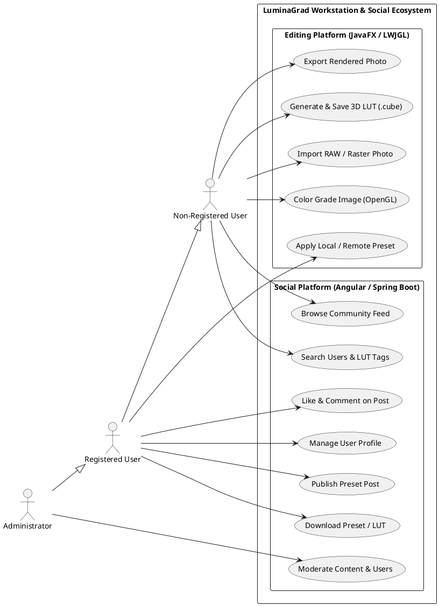
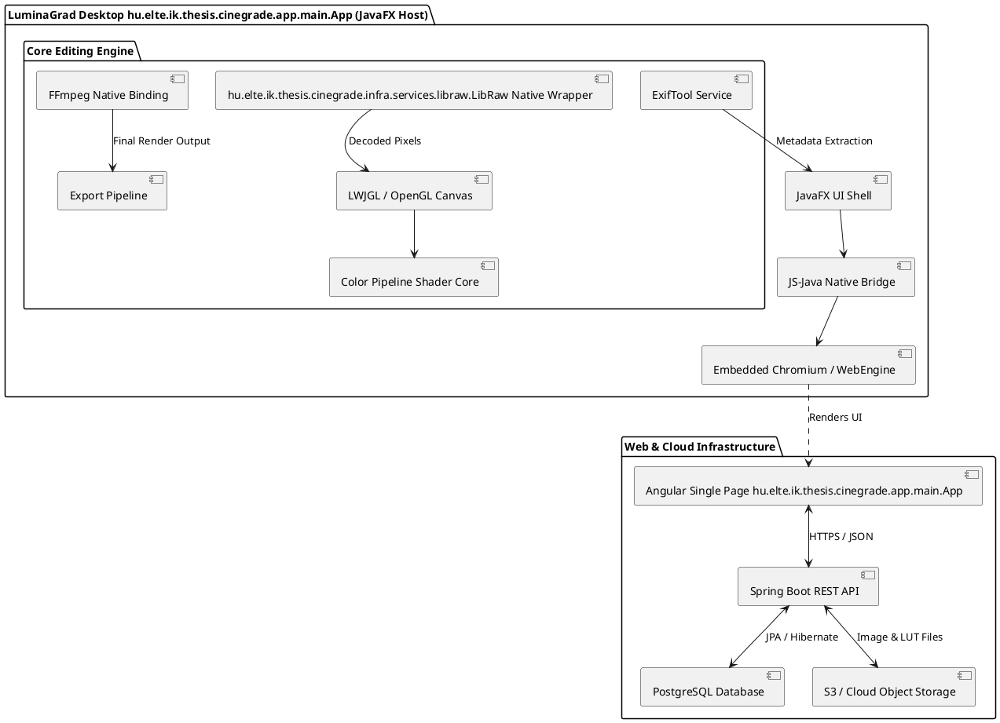
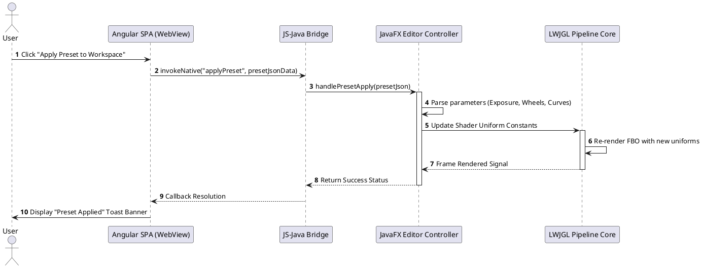

"# Software Requirements Specification (SRS) & System Architecture Plan
**Project Name:** CineGrade (Desktop & Web Color Grading Social Platform)  
**Author:** Hogyor Péter  
**Version:** 1.0.0  
**Date:** August 5, 2026  

---

## 1. Executive Summary & Architecture Overview

**CineGrade** is a hybrid desktop and web application designed for non-destructive photo color grading, LUT (Look-Up Table) generation, and visual preset sharing. The system integrates a high-performance native desktop workstation built with **JavaFX** and **LWJGL (OpenGL)** for real-time GPU-accelerated image manipulation with a community-driven web platform powered by **Angular**, **Spring Boot**, and **PostgreSQL**.

### 1.1 Key Architectural Highlights
- **Hybrid Desktop Workspace:** Real-time hardware-accelerated rendering engine running via LWJGL/OpenGL inside a JavaFX shell.
- **Embedded Web View & Bridge:** Embedded Chromium/WebEngine hosting the Angular UI, coupled via a bi-directional JS-Java bridge for seamless local asset passing and instant preset application.
- **Native Interoperability:** C/C++ bindings via JNI/FFM for **hu.elte.ik.thesis.cinegrade.infra.services.libraw.LibRaw** (RAW image decoding), integration with **ExifTool** (metadata handling), and **FFmpeg** (video/image encoding pipeline).
- **Preset & LUT Engine:** Complete color math pipeline supporting 3D LUT generation (.cube/.3dl) and non-destructive JSON adjustment manifests.

---

## 2. System Roles & Permission Matrix

| Feature / Capability | Non-Registered User | Registered User | Administrator |
| :--- | :---: | :---: | :---: |
| **Local Editing & LUT Export** | Full Access | Full Access | Full Access |
| **RAW Photo Import & Metadata Extraction** | Full Access | Full Access | Full Access |
| **Browse Social Platform & View Presets** | Read-Only | Read-Only | Read-Only |
| **Download LUTs / Presets to Local Catalog** | Disabled | Full Access | Full Access |
| **Publish Edits & Preset Recipes** | Disabled | Full Access | Full Access |
| **Like, Comment, & Follow Creators** | Disabled | Full Access | Full Access |
| **User Profile Management** | Disabled | Full Access | Full Access |
| **Content Moderation & User Management** | Disabled | Disabled | Full Access |

---

## 3. Comprehensive Feature Breakdown

### 3.1 Editing Platform (Native JavaFX / LWJGL)
1. **RAW & Raster Image Ingestion:**
   - Multi-format ingestion using **hu.elte.ik.thesis.cinegrade.infra.services.libraw.LibRaw** wrapper for major RAW formats (CR2, CR3, NEF, ARW, DNG) and standard images (JPEG, PNG, TIFF).
   - Metadata parsing and writing via **ExifTool** (EXIF, IPTC, XMP).
2. **GPU-Accelerated Color Grading (LWJGL/OpenGL):**
   - Real-time histogram, waveform vectorscope, and RGB parade displays.
   - Adjustments: Exposure, Contrast, Highlights, Shadows, Whites, Blacks, Temperature, Tint, Vibrance, Saturation.
   - Advanced Color Tools: 3-Way Color Wheels (Lift, Gamma, Gain), HSL/Color Mixer, Curves (RGB + Luma).
3. **Preset & LUT Pipeline:**
   - Export grade state as non-destructive JSON recipe files.
   - Render and export 3D Look-Up Tables (`.cube` format, $32 	imes 32 	imes 32$ or $64 	imes 64 	imes 64$ resolution).
   - Apply downloaded community LUTs directly onto the GPU rendering queue.
4. **Export & Compression Engine:**
   - High-quality export engine supporting JPEG, PNG, TIFF, and WebP using **FFmpeg** / Java ImageIO.

### 3.2 Social Platform (Angular Embedded Web hu.elte.ik.thesis.cinegrade.app.main.App)
1. **User Profiles & Personal Portfolios:**
   - Biography, profile picture, banner, social links, and organized highlight showcases.
2. **Community Feed & Preset Sharing ("Instagram for LUTs"):**
   - Publish graded photo posts with before/after sliders alongside attached preset metadata / LUT downloads.
   - Interactive feeds: Trending, Following, Recent, and Tagged.
3. **Social Engagement & Discovery:**
   - Like, comment, save to collections, follow creators.
   - Full-text search by camera model, lens, color style (e.g., "Moody", "Cinematic", "Vintage"), and user handles.

### 3.3 Inter-Process & Bridge Architecture
- **Desktop $\leftrightarrow$ Web Bridge:** JavaFX `WebView` executing an exposed Javascript interface `window.LuminaGradBridge`.
- **Action Flow:** Clicking "Apply Preset to Local Editor" in the embedded Angular app triggers a native call that downloads the LUT payload into the Java application's active editing cache without leaving the view.

---

## 4. Operational User Stories

### US-01: Non-Destructive Color Adjustment
- **As a** Photographer  
- **I want to** adjust color sliders (Exposure, White Balance, HSL, 3-Way Wheels) in real-time  
- **So that** I can grade my photo with instant visual feedback via the GPU viewport.  
- **Acceptance Criteria:**
  - Sliders update the LWJGL texture renderer within $< 16	ext{ ms}$ (60 FPS target).
  - Reset button restores original image state without loss of source image quality.

### US-02: 3D LUT Generation & Export
- **As a** Colorist  
- **I want to** export my current color grade configuration as a `.cube` file  
- **So that** I can use the visual style in external software like DaVinci Resolve or Premiere Pro.  
- **Acceptance Criteria:**
  - Export modal allows selecting grid size ($17^3$, $33^3$, $65^3$).
  - Output file strictly conforms to the Adobe 3D LUT Specification.

### US-03: Published Preset Synchronization
- **As a** Registered User  
- **I want to** click "Import to Editor" on a community post in the social tab  
- **So that** the exact grading parameters are injected directly into my active workspace slider stack.  
- **Acceptance Criteria:**
  - JS Bridge transfers the JSON recipe payload from Angular to JavaFX memory.
  - Workspace instantly re-renders the current photo using the newly imported values.

### US-04: Community Content Search
- **As a** User  
- **I want to** filter community posts by camera model, tags, or LUT parameters  
- **So that** I can find color presets tailored to my specific camera sensor.  
- **Acceptance Criteria:**
  - Dynamic API queries spring backend using indexed PostgreSQL fields.
  - Results display interactive before/after preview thumbnails.

---

## 5. System UML Diagrams (PlantUML Specification)

### 5.1 Use Case Diagram


### 5.2 High-Level Architecture Component Diagram


### 5.3 Sequence Diagram: Import Remote Community LUT to Local Workspace


---

## 6. Implementation Roadmap & Development Milestones

```
2026 Q3               2026 Q4               2027 Q1               2027 Q2
[ Milestone 1 ] ----> [ Milestone 2 ] ----> [ Milestone 3 ] ----> [ Milestone 4 ]
  Core Engine           Social Web Backend    Bridge & Integration   Thesis & Polish
```

* **Milestone 1: Native Core Engine (Months 1-2)**
  - Integrate hu.elte.ik.thesis.cinegrade.infra.services.libraw.LibRaw wrapper for RAW file loading.
  - Implement LWJGL viewport with custom GLSL shaders for basic exposure, white balance, and 3D LUT mapping.
* **Milestone 2: Web Platform & API (Months 3-4)**
  - Build Spring Boot REST backend with PostgreSQL schemas.
  - Develop Angular SPA for profile management, post creation, preset downloading, and feeds.
* **Milestone 3: WebView Bridge & Desktop Integration (Month 5)**
  - Integrate Angular web app inside JavaFX `WebView`.
  - Implement bi-directional JS-Java bridge for seamless local file passing and preset injection.
* **Milestone 4: Polish, Testing & Thesis Documentation (Month 6)**
  - End-to-end integration testing, GPU performance optimization, and thesis writing."
