# CineGrade — Import Pipeline Technical Specification & Implementation Guide

This document defines the complete architecture, data models, service pipelines, UI components, and the **exact sequential development order** required to build the photo importing system in CineGrade.

---

## 1. What You Need FIRST (The Dependency Chain)

To avoid getting stuck or creating broken dependencies, development must follow this strict sequence:

```mermaid
flowchart TD
    subgraph Step1["Step 1: Foundation (Prerequisites)"]
        S1A["1.1 Rename NavigationManager -> SceneManager\n(Remove scene history, keep ErrorHandler link)"]
        S1B["1.2 Create CatalogContext\n(Holds active Catalog, DB Connection, Managers)"]
        S1C["1.3 Create PanelController interface\n(initPanel, onEnter, onExit, canExit)"]
        S1D["1.4 Create NavigationController\n(Shell controller: switches Import | Development | Export)"]
    end

    subgraph Step2["Step 2: Data Models"]
        S2A["2.1 Implement PhotoEntry\n(Domain model matching 'photos' SQLite table)"]
        S2B["2.2 Implement ImportPhoto\n(Staging model for pre-import grid with isSelected)"]
    end

    subgraph Step3["Step 3: Staging UI Layer"]
        S3A["3.1 ImportPanelController\n(implements PanelController)"]
        S3B["3.2 Drag-and-Drop & FileChooser Handlers\n(Drop plate visual states)"]
        S3C["3.3 Staging Grid & ImportPhotoCard\n(Thumbnails, checkbox, remove [✕], RAW badge)"]
    end

    subgraph Step4["Step 4: Background Service & Native Tools"]
        S4A["4.1 ExifToolService & Fast Thumbnail Extraction\n(Extract embedded JPEG preview to disk cache)"]
        S4B["4.2 BatchImportService extends Service<List<PhotoEntry>>\n(RAW+JPG pairing, validation, progress updates)"]
    end

    subgraph Step5["Step 5: Database & PhotoManager"]
        S5A["5.1 PhotoDao, MetadataDao, EditstateDao\n(Transactional batch inserts)"]
        S5B["5.2 PhotoManager\n(allPhotos, lastImportPhotos dispatch)"]
        S5C["5.3 Auto-switch to Development Panel on completion"]
    end

    Step1 --> Step2 --> Step3 --> Step4 --> Step5
```



---

## 2. Step-by-Step Implementation Breakdown

### STEP 1: Foundation & Navigation Refactoring (Build This First!)

Before writing any import UI, the application shell must be able to host and switch panels cleanly without monolithic god objects.

#### 1.1 `SceneManager` (Formerly `SceneManager`)
- **Package**: `hu.elte.ik.thesis.cinegrade.domain.navigation`
- **Role**: Top-level window manager. Manages `Stage`, `Scene`, root styles (`ThemeManager`), toast notifications, and global dialogs.
- **Key Changes**:
  - Remove `viewHistories` queue. Top-level scenes (`SPLASH`, `PROJECT_MENU`, `EDIT_PAGE`) are discrete states, not a browser history.
  - Keep `switchView(ViewType)` and `getActiveWindow()`.
  - Ensure `ErrorHandler.getInstance().setSceneManager(sceneManager)` remains intact.

#### 1.2 `CatalogContext` (Project Session Scope)
- **Package**: `hu.elte.ik.thesis.cinegrade.domain.catalog`
- **Role**: Created when a `.cgproj` catalog is opened; disposed when closed. Eliminates the monolithic `ApplicationManager`.
- **Fields**:
  ```java
  public class CatalogContext {
      private final Catalog catalog;
      private final Connection connection;
      private final PhotoManager photoManager;
      private final ImportManager importManager;
      private final EditingManager editingManager;
      private final TagManager tagManager;
      private final Path cacheDirectory;      // <catalog_dir>/cache/thumbnails
      // Lifecycle:
      public void close(); // flushes pending DB writes, closes connection, disposes textures
  }
  ```

#### 1.3 `PanelController` Lifecycle Interface
- **Package**: `hu.elte.ik.thesis.cinegrade.javafx.ui.common`
- **Role**: Contract implemented by `ImportPanelController`, `DevelopmentPanelController`, and `ExportPanelController`.
  ```java
  public interface PanelController {
      /** Called once when the workspace initializes with the active project context */
      void initPanel(CatalogContext context, NavigationController navController);

      /** Called whenever this panel becomes active / visible */
      void onEnter();

      /** Called when navigating away to another panel */
      void onExit();

      /** Guard against leaving while operations (e.g. batch import) are running */
      default boolean canExit() { return true; }
  }
  ```

#### 1.4 `NavigationController` (Workspace Shell)
- **Package**: `hu.elte.ik.thesis.cinegrade.javafx.ui.workspace`
- **Role**: Controls the top pill navigation bar (`[ Import ]` `[ Development ]` `[ Export ]`).
- **Methods**:
  - `switchTo(WorkspacePanel panel)`: Calls `onExit()` on current panel, switches visible pane, calls `onEnter()` on next panel.
  - `switchToPrevious()`: Used by `ImportPanelController`'s `Cancel` button to return to the last active panel (usually `Development`).

---

### STEP 2: Data Models

#### 2.1 `ImportPhoto` (Staging Model)
- **Package**: `hu.elte.ik.thesis.cinegrade.domain.catalog`
- **Role**: Represents a candidate file on the staging plate before it is committed to SQLite.
- **Fields & Properties**:
  ```java
  // [AI-GENERATED]
  public class ImportPhoto {
      private final File file;
      private final long fileSize;
      private final boolean isRaw;
      private final String format;            // "CR3", "ARW", "NEF", "JPG", "DNG"
      private File pairedJpegFile;            // Non-null if RAW + JPG were shot together
      private final BooleanProperty selected = new SimpleBooleanProperty(true);
      private final BooleanProperty duplicate = new SimpleBooleanProperty(false);
      private Image previewThumbnail;         // Fast embedded preview for staging card
      
      // Getters, Setters, Property accessors
  }
  ```

#### 2.2 `PhotoEntry` (Catalog Entity)
- **Package**: `hu.elte.ik.thesis.cinegrade.domain.editing`
- **Role**: Represents a photo committed to the catalog database (matches `photos` table).
- **Fields**:
  - `String id` (UUID)
  - `Integer folderId`
  - `String filePath` (Absolute path on disk)
  - `String fileName`
  - `long fileSize`
  - `String thumbnailPath` (Path to cached thumbnail: `.cgproj_cache/thumbnails/[id].jpg`)
  - `int rating` (0..5)
  - `String colorLabel`
  - `Instant dateImported`
  - `List<String> tags`

---

### STEP 3: Staging UI Layer (`ImportPanelController`)

- **Package**: `hu.elte.ik.thesis.cinegrade.javafx.ui.file`
- **FXML**: `src/main/resources/fxmls/importPanel.fxml`
- **Responsibilities**:
  1. **Drag-and-Drop on Central Plate (`Rectangle 138`)**:
     - `setOnDragOver`: Check if `event.getDragboard().hasFiles()`. Set `TransferMode.COPY`.
     - `setOnDragEntered`: Apply glowing accent border to plate (`.dropzone-active`).
     - `setOnDragExited`: Remove active border styling.
     - `setOnDragDropped`: Extract files, pass to `importManager.stageFiles(files)`.
  2. **File & Folder Selection**:
     - `openFilesButton`: Opens `FileChooser` with extensions: `*.cr2`, `*.cr3`, `*.nef`, `*.arw`, `*.dng`, `*.jpg`, `*.jpeg`, `*.png`, `*.tiff`.
     - `selectFolderButton`: Opens `DirectoryChooser` to recursively scan a camera card or shoot directory.
  3. **Staging Grid**:
     - Responsive `TilePane` or `FlowPane` inside a `ScrollPane`.
     - Displays `ImportPhotoCard` components for each staged photo.
     - **Card Interactions**:
       - Checkbox toggle: updates `importPhoto.setSelected(...)`.
       - Card click: toggles checkbox.
       - Remove `[✕]` button: calls `stagingList.remove(importPhoto)`.
       - Deselected state: card opacity drops to `0.55`, showing it is skipped.
  4. **Batch Controls & Dynamic Button**:
     - `Select All`: sets `selected = true` on all items.
     - `Deselect All`: sets `selected = false` on all items.
     - `Import (N)` Button: label dynamically bound to count of items where `selected == true`. Disabled if count is 0.
     - `Cancel` Button: calls `onExit()`, then `navController.switchToPrevious()`.

---

### STEP 4: Background Service & Native Tools Pipeline

#### 4.1 Fast Embedded Thumbnail Extraction Strategy
> **Critical Performance Rule**: NEVER run a full LibRaw demosaic to generate an import thumbnail! A full 24–45MP RAW demosaic takes 1.5–3 seconds per photo. 100 photos would freeze the app for 4 minutes!
> 
> **The Fast Solution**: Every RAW file (.CR2, .CR3, .ARW, .NEF, .DNG) contains an **embedded full-resolution or medium preview JPEG** written by the camera.
> - Extracting this embedded preview takes **only 15–25 milliseconds**!
> - Use `ExifTool` (`exiftool -b -PreviewImage input.raw > thumb.jpg` or `-JpgFromRaw`) or LibRaw's fast preview extraction.
> - Save to: `<catalog_directory>/cache/thumbnails/<photo_uuid>.jpg` (max dimension 512px).

#### 4.2 RAW + JPEG Pairing Algorithm
When scanning dropped files:
1. Group files by base name (e.g. `DSC_0042.CR3` and `DSC_0042.JPG`).
2. If both a RAW format and a JPEG exist with the same base name:
   - Create **one** `ImportPhoto` entry.
   - Designate the RAW file as primary.
   - Reference the JPEG as `pairedJpegFile` (use it directly for instant thumbnail extraction).
   - Flag format badge as `RAW + JPG`.

#### 4.3 `BatchImportService extends Service<List<PhotoEntry>>`
- **Package**: `hu.elte.ik.thesis.cinegrade.tasks`
- **Thread Management**: Dispatched through `TaskManager` on the IO thread pool.
- **Execution Pipeline**:
  ```
  For each selected ImportPhoto (i of total):
    1. updateProgress(i, total);
    2. updateMessage("Importing " + photo.getFileName() + " (" + i + "/" + total + ")...");
    3. Generate UUID for photo.
    4. Extract/cache thumbnail -> cache/thumbnails/<uuid>.jpg
    5. Read EXIF metadata via ExifToolService (camera, lens, ISO, shutter, aperture, capture date).
    6. Construct PhotoEntry & PhotoMetadata objects.
    7. Construct initial default EditState (exposure=0, contrast=0, temp=5500, etc.).
    8. Add to batch buffer.
  ```

---

### STEP 5: Database Transactions & PhotoManager Dispatch

#### 5.1 Transactional Batch Inserts
To ensure importing 500 photos takes under 1 second in SQLite, all inserts MUST occur in a single transaction:

```java
// Inside PhotoDao / ImportManager:
connection.setAutoCommit(false);
try {
    photoDao.batchInsert(photoEntries);        // INSERT INTO photos ...
    metadataDao.batchInsert(metadataEntries);  // INSERT INTO photo_metadata ...
    editstateDao.batchInsert(defaultStates);   // INSERT INTO edit_states ...
    if (appliedTags != null && !appliedTags.isEmpty()) {
        tagDao.batchAssignTags(photoIds, appliedTags);
    }
    connection.commit();
} catch (SQLException ex) {
    connection.rollback();
    throw new CineGradeException(ErrorCode.DB_TRANSACTION_FAILED, ex, "Batch import transaction failed");
} finally {
    connection.setAutoCommit(true);
}
```

#### 5.2 Updating `PhotoManager`
Once the database transaction commits:
```java
Platform.runLater(() -> {
    photoManager.getLastImportPhotos().setAll(newlyImportedPhotos);
    photoManager.getAllPhotos().addAll(newlyImportedPhotos);
    
    // Switch to Development view with newly imported photos selected
    navController.switchTo(WorkspacePanel.DEVELOPMENT);
});
```

---

## 3. Filesystem & Cache Structure

When a catalog `MyShoot.cgproj` is created at `D:/Projects/MyShoot/`:

```
D:/Projects/MyShoot/
├── MyShoot.cgproj                # SQLite database (catalog metadata, photos, edits, tags)
├── cache/
│   ├── thumbnails/              # Fast thumbnails (512px JPEG, ~80KB each)
│   │   ├── 4a8b-9c2d..._thumb.jpg
│   │   └── e1f2-3a4b..._thumb.jpg
│   └── raw_cache/               # Temporary demosaic scratch files
└── settings/                    # Catalog-specific preferences (JSON)
```

---

## 4. Verification Checklist for the 12-Hour Sprint

| Check | Test Scenario | Expected Result |
| :---: | :--- | :--- |
| **[ ]** | Drag 1 RAW file onto the drop plate | Plate glows blue on drag-over; card appears with checkbox `[✓]`, `RAW` badge, and thumbnail. |
| **[ ]** | Drag a folder with mixed RAW + JPEG | Matching RAW+JPG pair into single cards; total size and photo count calculate correctly. |
| **[ ]** | Click `[☐ Deselect All]` then select 2 cards | Button reads `Import (2)`; deselected cards dim to 55% opacity. |
| **[ ]** | Click remove `[✕]` on a card | Card is removed from staging; staging counter updates. |
| **[ ]** | Click `[Cancel]` | Staging clears; workspace switches back to `Development` panel without errors. |
| **[ ]** | Click `[Import (N)]` | Progress bar displays; thumbnails write to `cache/thumbnails/`; records appear in SQLite `photos` and `photo_metadata`. |
| **[ ]** | Post-Import Transition | View automatically switches to `Development`; filmstrip displays imported photos immediately. |
