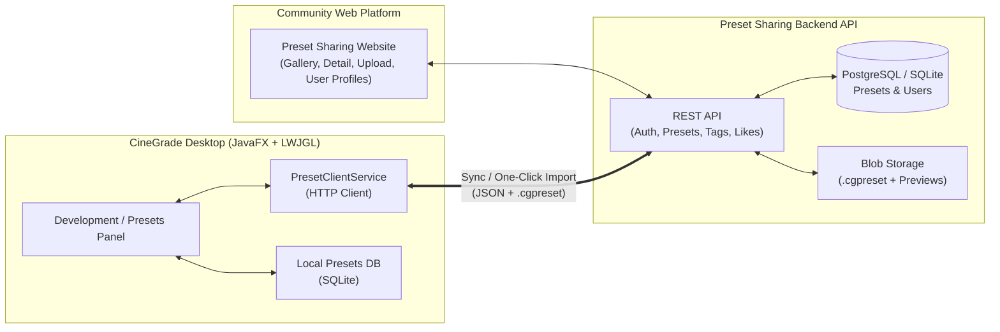
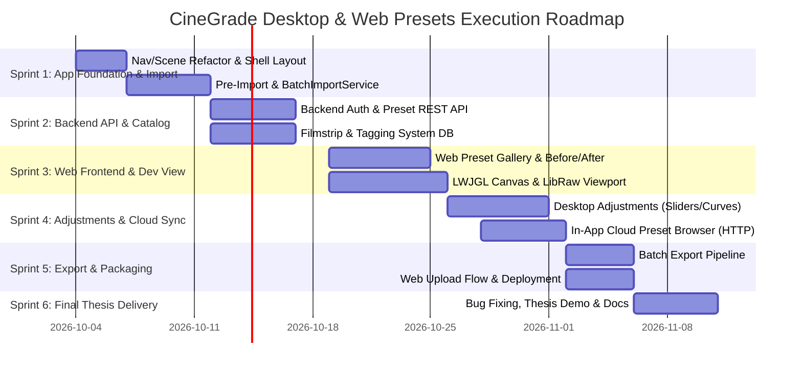

# CineGrade Master Project Execution Plan (Desktop App + Preset Platform)

> **Target Submission Date**: November 10, 2026 (**37 Days Remaining**)  
> **Total Available Effort**: **~228 Engineering Hours**  
> - Weekdays: 27 days × 4h = 108 hours  
> - Weekends: 10 days × 12h = 120 hours  

---

## 1. System Ecosystem Architecture



---

## 2. Realistic Effort Allocation (228 Hours Total)

To prevent scope creep and guarantee on-time completion by November 10, the effort is strictly divided into three balanced tracks:

```
┌────────────────────────────────────────────────────────────────────────┐
│ TRACK A: CineGrade Desktop Application          130 Hours (57%)        │
│ • Navigation, SceneManager, Shell & Panels       (~15h)                │
│ • Full Import Pipeline (Staging, Raw/JPG, Exif)  (~30h)                │
│ • Catalog Explorer, Filmstrip & Tagging DB       (~25h)                │
│ • Development Panel, LibRaw & LWJGL Viewport     (~40h)                │
│ • Sliders, Curves, LUTs & Batch Export           (~20h)                │
├────────────────────────────────────────────────────────────────────────┤
│ TRACK B: Preset Sharing Backend & Cloud Storage   40 Hours (18%)       │
│ • User Auth & JWT Security                       (~8h)                 │
│ • Presets CRUD API (Upload, Download, Search)    (~14h)                │
│ • Preview Image Storage & Thumbnail Processing   (~10h)                │
│ • Likes, Ratings & Tagging Taxonomy API          (~8h)                 │
├────────────────────────────────────────────────────────────────────────┤
│ TRACK C: Community Web Frontend                   38 Hours (16%)       │
│ • Preset Gallery with Search, Sorting & Tags     (~12h)                │
│ • Preset Detail View (Interactive Before/After)  (~10h)                │
│ • Web Preset Upload Form & User Dashboard        (~10h)                │
│ • Direct "Open in CineGrade" Protocol Handler    (~6h)                 │
├────────────────────────────────────────────────────────────────────────┤
│ TRACK D: Desktop-Cloud Integration & Thesis Doc   20 Hours (9%)        │
│ • In-App Preset Cloud Browser & 1-Click Install  (~10h)                │
│ • Thesis Demo Preparation, Packaging & Polish    (~10h)                │
└────────────────────────────────────────────────────────────────────────┘
```

---

## 3. Recommended Tech Stack for Rapid Web Delivery

To build a **full-fledged backend + frontend in ~78 hours**, avoiding boilerplate is paramount:

### Option 1 (Fastest & Most Modern — Recommended): **Next.js + Prisma + PostgreSQL**
- **Single Monorepo**: Frontend and Backend live in one project (`/web`).
- **Backend**: Next.js App Router Server Actions + Route Handlers (`/api/presets`, `/api/auth`).
- **Database & ORM**: PostgreSQL (e.g. Supabase or Neon free tier) + Prisma ORM.
- **Auth**: NextAuth.js / Supabase Auth (ready-to-use email/password & GitHub auth in 2 hours).
- **UI**: Tailwind CSS + shadcn/ui components (cards, dialogs, sliders built in 1 day).

### Option 2 (Pure Java Ecosystem): **Spring Boot 3 + React / Thymeleaf**
- **Backend**: Spring Boot 3 with Spring Security, Spring Data JPA, and H2/PostgreSQL.
- **Advantage**: Can directly share preset JSON serialization classes with CineGrade.
- **Frontend**: Lightweight React/Vite SPA or Next.js frontend talking to Spring Boot REST endpoints.

---

## 4. The Shared `.cgpreset` Protocol

The Desktop application and Web platform speak the exact same preset exchange schema:

```json
{
  "id": "preset_uuid",
  "name": "Kodak Portra 400 Warm",
  "author": "cinegrade_user",
  "version": "1.0",
  "description": "Golden skin tones and gentle film roll-off",
  "tags": ["Film", "Warm", "Portrait", "Vintage"],
  "parameters": {
    "exposure": 0.25,
    "contrast": 1.15,
    "highlights": -0.30,
    "shadows": 0.20,
    "temperature": 5800.0,
    "tint": 4.5,
    "saturation": 0.95,
    "vibrance": 1.05,
    "curves": { "rgb": "...", "red": "...", "green": "...", "blue": "..." },
    "lut": null
  },
  "preview": {
    "before_url": "https://storage.../before.jpg",
    "after_url": "https://storage.../after.jpg"
  }
}
```

---

## 5. Day-by-Day Milestone Schedule (Oct 4 – Nov 10)



| Dates | App Focus | Web & Backend Focus | Output |
| :--- | :--- | :--- | :--- |
| **Oct 4 – Oct 8** | Navigation refactor, `SceneManager`, `CatalogContext`, Shell | Define `.cgpreset` schema & Swagger API spec | Working Shell navigation |
| **Oct 9 – Oct 14** | Complete Import pipeline (Staging, RAW+JPG, ExifTool, DB) | Setup Backend Repo & DB schema (Auth, Presets table) | Fully working photo import |
| **Oct 15 – Oct 20** | Filmstrip, Tagging Explorer, multi-tag filter | Build REST endpoints: `/api/presets` CRUD, search, upload | Stored presets & live tags |
| **Oct 21 – Oct 27** | Development panel core, LWJGL viewport, LibRaw | Web Frontend: Gallery, Before/After card, filter by tag | Browse presets on web |
| **Oct 28 – Nov 2** | Sliders, RGB tone curves, History/Undo | In-App Preset Browser (download & apply cloud preset) | 1-Click Preset Cloud Sync |
| **Nov 3 – Nov 6** | Batch Export Pipeline (JPEG/TIFF) | Web User Profiles & Upload Preset page live | End-to-end ecosystem working |
| **Nov 7 – Nov 10** | Memory leak profiling, build packaging, thesis demo | Deploy Web & API (Vercel / Render / Supabase) | Final submission ready! |
